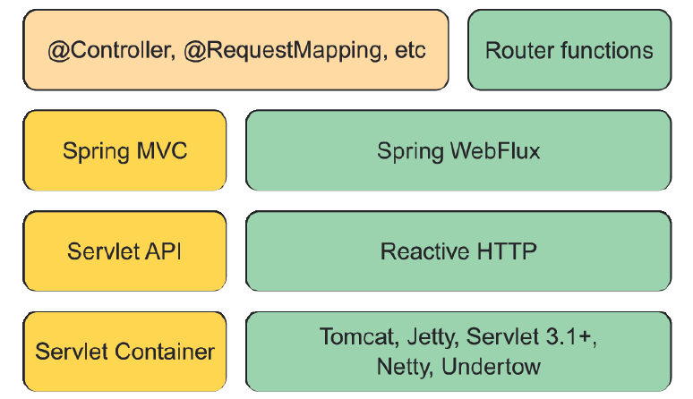

### 12.1.1 Spring WebFlux 介绍

当 Spring 团队正在考虑如何添加一个响应式编程模型的网络层，很快就发现，如果不在 Spring MVC 做很大的改动，很明显这样做是很困难的。这将涉及到分支代码来决定是否响应式地处理请求。在本质上，其结果将是把两个 web 框架打包成一个，用 if 语句来分离响应式与非响应式。

最终决定创建一个单独的响应式 web 框架，这个框架尽可能的借鉴 Spring MVC，而不是强行把响应式编程模型塞进 Spring MVC 中。Spring WebFlux 就是这个框架了。图 12.2 展示了由 Spring 所定义的完整的 web 开发技术栈。


**图 12.2 Spring 通过名为 WebFlux 的新 web 框架支持响应式式 web 应用程序，WebFlux 是 Spring MVC 的兄弟，它们共享许多核心组件** <br/>

在图 12.2 的左侧，可以看到 Spring MVC 技术栈，它是在 Spring 框架的 2.5 版中引入的。SpringMVC（在第 2 章和第 6 章中介绍）位于 Java Servlet API 之上，它需要一个 Servlet 容器（比如 Tomcat）来执行。

相比之下，Spring WebFlux（在右侧）与 Servlet API 没有关系，因此它构建在一个响应式 HTTP API 之上，这个方式与使用 Servlet API 提供的相同的响应式功能类似。而且由于 Spring WebFlux 没有耦合到 Servlet API，因此它不需要运行一个 Servlet 容器。相反，它可以在任何非阻塞 web 容器上运行，包括 Netty、Undertow、Tomcat、Jetty 或任何 Servlet3.1 或更高版本的容器。

图 12.2 最值得注意的是左上角的框，它表示了 Spring MVC 和 Spring WebFlux 之间常见的组件，主要是用于定义 controller 的注解。由于 Spring MVC 和 Spring WebFlux 共享相同的注解，Spring WebFlux 在许多方面与 Spring MVC 没有区别。

右上角的框表示另一种编程模型，该模型使用函数式编程范式而不是使用注解来定义 controller。我们将在第 12.2 节中详细讨论 Spring 的函数式 web 编程模型。

Spring MVC 和 Spring WebFlux 之间最显著的区别就是添加到构建中的依赖项不同。在使用 Spring WebFlux 时，需要添加 Spring Boot WebFlux starter 依赖项，而不是标准的 web starter（例如，spring-boot-starter-web）。在项目的 pom.xml 文件中，如下所示：

```xml
<dependency>
  <groupId>org.springframework.boot</groupId>
  <artifactId>spring-boot-starter-webflux</artifactId>
</dependency>
```

> 注意：与大多数 Spring Boot 的 starter 依赖项一样，这个 starter 也可以通过选中 Initializr 中的 Reactive Web 复选框添加到项目中。

使用 WebFlux 而不是 Spring MVC 的一个有趣的副作用是，WebFlux 的默认嵌入式服务器是 Netty 而不是 Tomcat。Netty 是少数几个异步的事件驱动的服务器之一，它自然适合像 Spring WebFlux 这样的响应式 web 框架。

除了使用不同的 starter 依赖项之外，Spring WebFlux controller 方法通常接受并返回响应式类型，比如 Mono 和 Flux，而不是域类型和集合。Spring WebFlux 控制器还可以处理 RxJava 类型，比如 Observable、Single 和 Completable。

#### 响应式 Spring MVC？

尽管 Spring WebFlux controller 通常返回 Mono 和 Flux，但这并不意味着 Spring MVC 在处理响应式类型时没有办法。如果您愿意，Spring MVC controller 方法也可以返回 Mono 或 Flux。

不同之处在于如何使用这些类型。Spring WebFlux 是一个真正的响应式 web 框架，允许在 event loop 中处理请求，而 Spring MVC 是基于 Servlet 的，依赖多线程处理多个请求。

让我们通过重写一些 Taco Cloud 的 API controller 来让 Spring WebFlux 工作。

